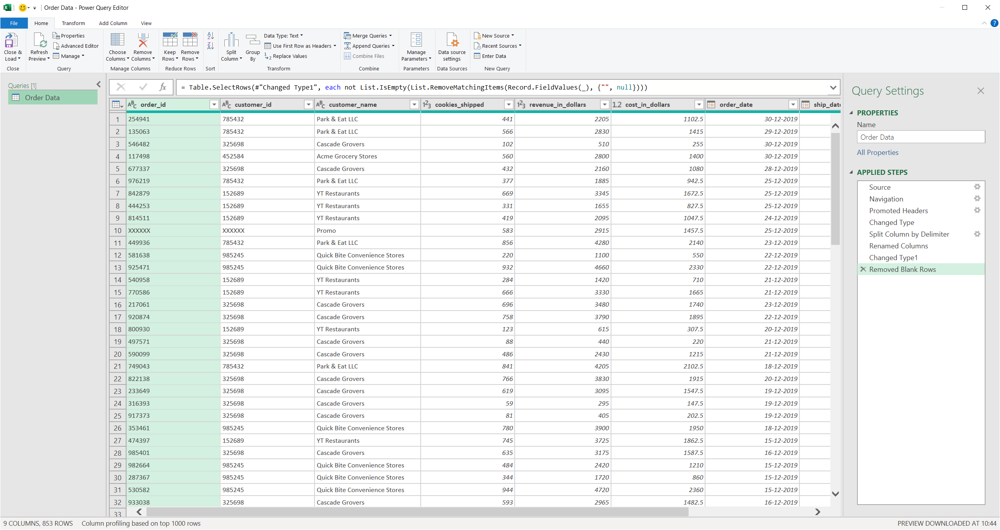

# Transport Data Analysis | 2024-06-15

Data Analysis for transport data.

## Summary of Steps Performed are as follows:

1. Data Cleaning

## 1 - Data Cleaning

In data cleaning following were performed in sequence:

1. Split `Customer Id` column into `Customer ID` and `Customer Name`.
2. Remove Blank Rows
3. No `Error` fields were present, hence Error Revoval skipped.
4. No `NULL` values are present, hence NULL Removal skipped.
5. Rename Columns to lower case snake case.
   
6. Add 2 new derived columns based on need

   1. `days_from_order_to_ship` - Days from substracting `order_date` from `ship_date`
   2. `retail_in_dollars` - Cost from adding `cost_in_dollars` to `revenue_in_dollars`.

   
